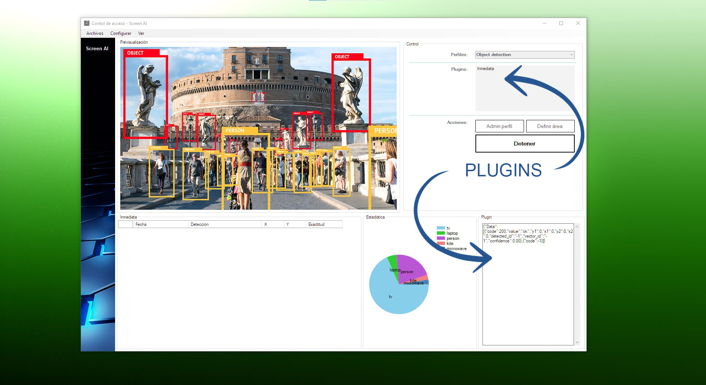

# Plugin para ScreenAI
En este proyecto se muestra la estructura básica de una librería/plugins para ScreenAI, el sistema de análisis de imagen basado en las API de Proyecto Horus.



# ¿De que trata?
El presente proyecto corresponde a un fuente demo para la creación de plugins para la interfaz de análisis de imagen ScreenAI el cual podrá descargar sin cargo desde:
http://www.proyectohorus.com.ar/ScreenAI

Screan AI, permite realizar análisis de imagen usando diversos mecanismos basados en DeepLearning a través de captura de pantalla en tiempo real.
Para realizar dicha tarea se utiliza las APIs de Proyecto Horus (http://www.proyectohorus.com.ar/), servicio Cloud basado en tecnología NVidia EGX v100.

# Como dialoga el HOST con el PLUGIN
ScreenAI como host del plugin enviara un conjunto de valores formateados en JSON según la siguiente estructura:

```json
{
"Data": [
{
    "code":200,
    "value":"ok",
    "y1":0,
    "x1":0,
    "y2":0,
    "x2":0,
    "detected_id":"-1",
    "vector_id":"-1",
    "confidence":0.00
},
{
    "code":-1
}
]
}
```

Donde: 
- Code: Corresponde al valor de respuestas del servidor con 200 como un código que indica que el mensaje esta OK y con -1 como final del mensaje.
- X1 e Y1: Corresponden a valores sin escalar de las coordenadas del vertice superior izquierdo del box que delimita el área de detección. 
- X2 e Y2: Corresponden a valores sin escalar de las coordenadas del vertice inferior derecho del box que delimita el área de detección.

**Nota: Sin escalar significa que se deberá multiplicar cada valor flotante devuelto por el host por un valor integral que represente el ALTO o ANCHO de la imagen sobre la cual se realiza el análisis, ejemplo:**

**Si el área de captura de pantalla fue ajustada en 640x480 deberemos multiplicar los valores X1 y X2 por el ancho del área, o sea 640 y los valores Y1 e Y2 por los valores del alto del área, o sea 480, recuperando asi las coordenadas en integral correspondientes a cada vértice.**
 
- detected_id: Es el nombre canónico del objeto detectado en el box.
- vector_id: Corresponde a un valor interno que define el traking de un box a lo largo de la captura.
- Confidence: Por último Confidence nos indica que tan certera es la detección.
